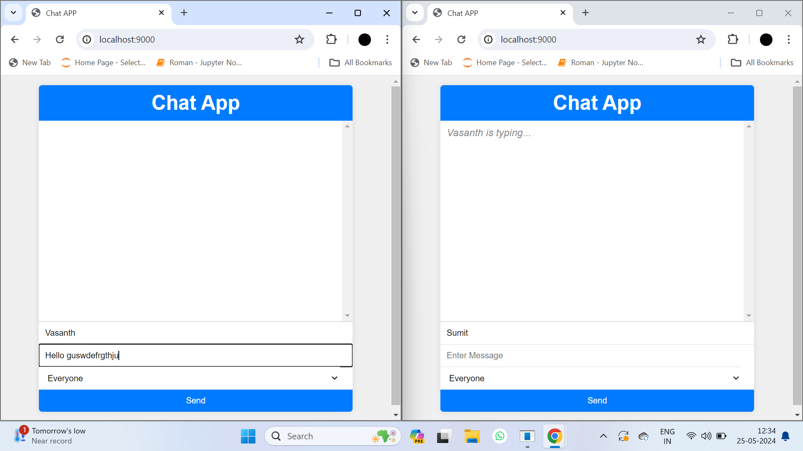
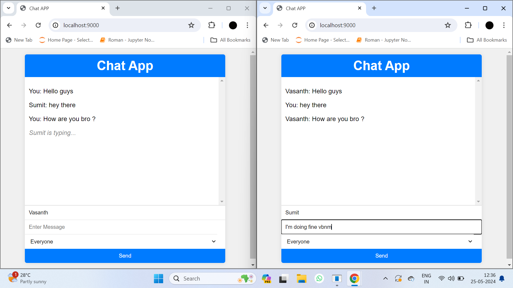
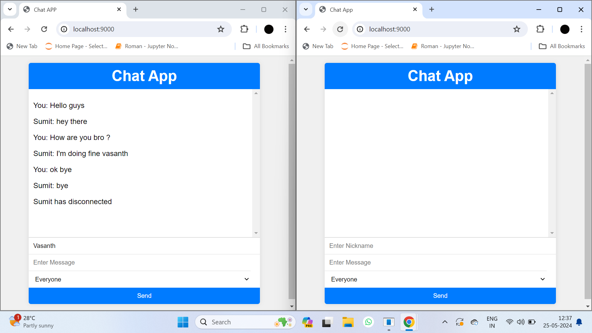

# Chat App Using WebSockets

This chat application allows users to communicate in real-time. It supports broadcasting messages to all users, private messaging, user nicknames, and live status updates for users joining or leaving the chat. The application is built using Node.js, Express.js for the server, and Socket.io for WebSockets communication.

## Screenshots

### Output Screenshot


### Users can chat in real-time


### User can exit the room/chat


## Features

- Real-time messaging
- Private messaging
- Nicknames support
- "User is typing" notification
- Live user status updates
- Stunning UI 

## How to Run the Project

1. **Clone the repository:**

    ```bash
    git clone https://github.com/vasanthsai14/Chat-App-Using-WebSockets.git
    ```

2. **Navigate to the project directory:**

    ```bash
    cd Chat-App-Using-WebSockets
    ```

3. **Install the dependencies:**

    ```bash
    npm install
    ```

4. **Run the server:**

    ```bash
    npm start
    ```

5. **Open your browser and go to:**

    ```
    http://localhost:9000
    ```

## Socket.io Explanation

Socket.io is a JavaScript library for real-time web applications. It enables real-time, bidirectional, and event-based communication between web clients and servers. Socket.io consists of two parts:

- A server-side library for Node.js
- A client-side library that runs in the browser

### Key Concepts:

- **Connection:** Establishes a connection between the client and server.
- **Events:** Named messages sent between the client and server.
- **Broadcasting:** Sending a message to multiple clients.

### Example Usage:

In the server code:
```javascript
io.on("connection", (socket) => {
    socket.on("user-message", (data) => {
        socket.broadcast.emit("message", data);
    });
});
